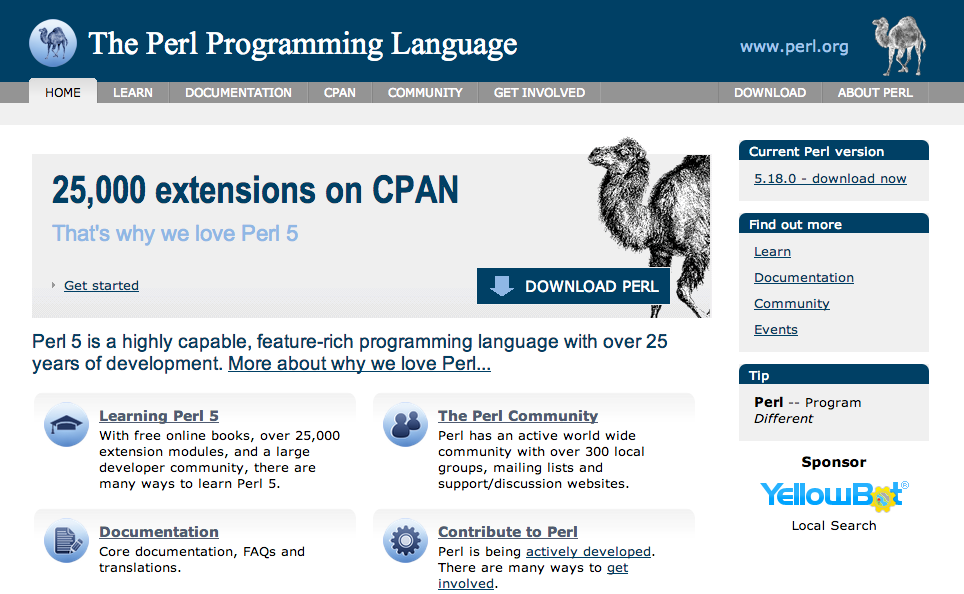
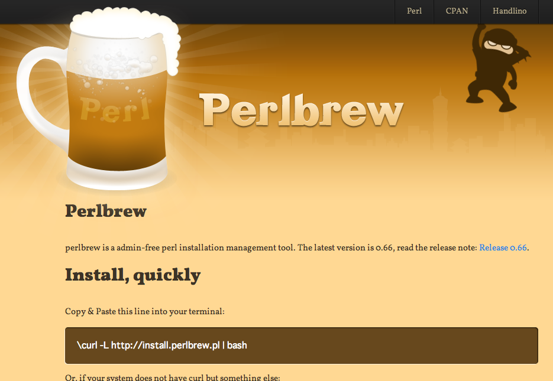
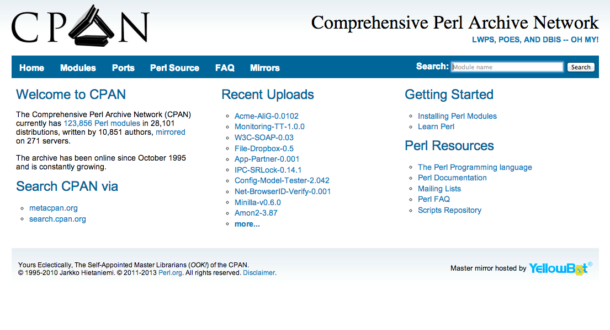
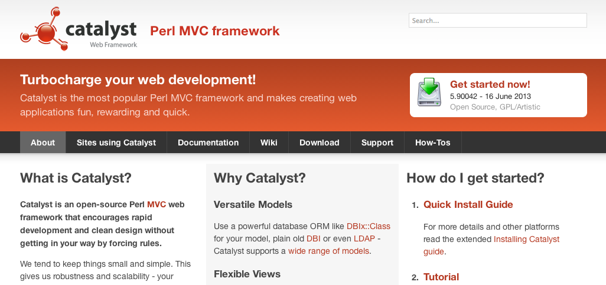
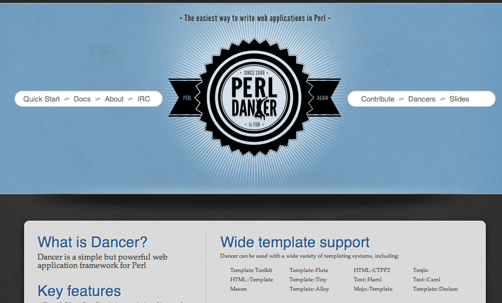
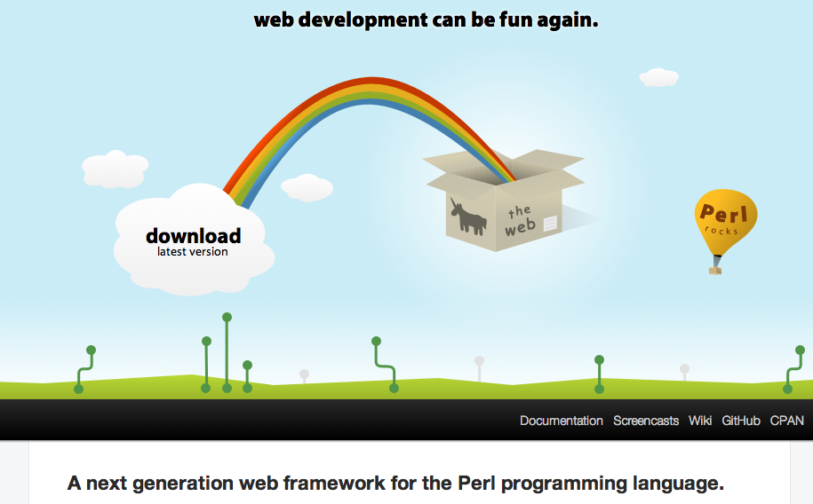
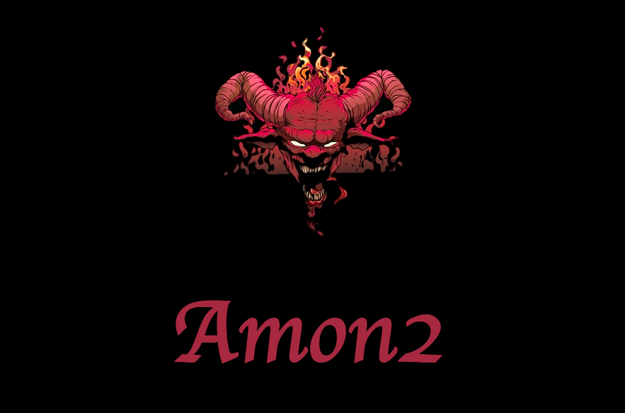
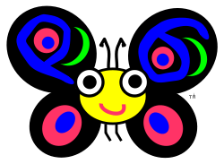
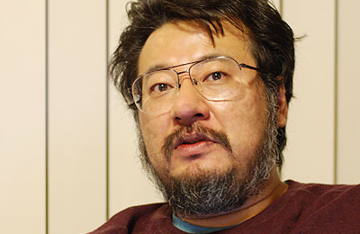
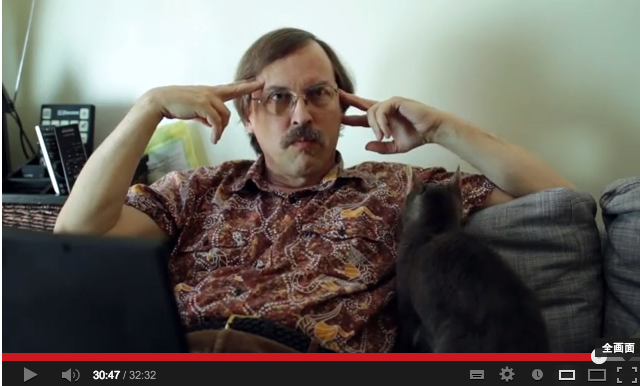

Larry Wall
===
### について調べてみた

   
   

2013/08/23 masakyst

Yomitan.pm

自己紹介
---

* さいとう まさあき
* 沖縄 読谷村
* Perl好き
* Yomitan.pm (非公式perl mongers group)

 

Twitter @masakyst

Larry Wallとは
---

(左!

(右は、Perl hacker 小飼弾さん

プログラミング言語 Perl を開発した人
---

アニメ好き
---

日本好きでもあるし、大のアニメ好きでもある...!!!

 

* るろうに剣心
* 少女革命ウテナ
* あずまんが大王
* マクロス(たぶん

ホンダ好き？
---

ホンダのアコード初代1977年式に29年乗ってる。

プログラマの三大美徳
---

プログラマの三大美徳を唱え始めたのもラリー・ウォールである

 

### 怠惰

### 短気

### 傲慢

プログラマに必要とされる効率や再利用性の重視・処理速度の追求・品質に賭ける自尊心を言ったものである。(wikipedia

むしろコミュニティについて当てはまるのは
---

### 努力

### 忍耐

### 謙遜

この六つの徳目は正反対のものではない。それらを同時に持つ事ができるからだ。
我々人類をここまで導いてくれた徳目なのである。そして我々が途中で投げ出さない限り、これからも我々人類のコミュニティを未来へと導いてくれる徳目なのである。

LarryとPerl
---

現在、Perlには、Perl5 と Perl6 があります。

 

Perl5 と Perl6 は別系統。現在Larryは、Perl6の開発を中心に行っているようです。
Perl5の開発の方は、Perl5 portersというチームを中心として開発管理されています。

 

ので、Perl5の開発は、Perl6が出ても続けられます。
むしろ最近のPerl5の開発はとても意欲的ですし、言語コアの開発も、ライブラリの開発も前以上にどんどん進んでいます。

Perlbrew や plenv
---

Perlインタプリタを複数インストールでき、管理するもの

cpanm や Carton
---

CPANモジュールのインストールを使いやすくするもの

Catalyst
---

Perl on Rails的なWebアプリフレームワーク

Dancer
---

DSLでシンプルに書ける

Mojolicious
---

単体サーバ、組み込みWebSocket、オールインワン

Amon2
---

小規模から大規模まで, PSGIとの親和性高い 

Perl6
---

### Rakudo star, NQP

### Niecza Perl6

### Perlito

### MoarVM

LarryとYAPC::Asia
---

結構、日本に来てる

http://yapcasia.org/2013/08/yapcasia2013-party.html?utm_source=twitterfeed&utm_medium=twitter

YAPC::NAで...!!
---

お菓子をかばんに入れるLarryが目撃されている

 

http://blog.livedoor.jp/xaicron/archives/2013-06.html

フィギュアになってる
---

もともとネタとしてカスタム製作されたものなので、世界に3体しかないらしい。

小飼弾のアルファギークに逢いたい♥
---

Web+DB Press

Perlの父 Larry Wall

http://gihyo.jp/dev/serial/01/alpha-geek/0000

35歳からのプログラミングこそ無上の至悦
---

まじ読んだ方が良い 

http://www.itmedia.co.jp/enterprise/articles/0801/10/news017.html

35歳からのプログラミングこそ無上の至悦
---

  

 「Perlに引かれたというよりはラリー・ウォールに引かれたのが大きい」

 

 「ラリー・ウォールはわたしの心を盗んでいきました」

 

 「人の心までハックできるハッカーはわずか」

35歳からのプログラミングこそ無上の至悦
---

  

## まじ読んだ方が良い 

Hacker Interviews: Larry Wall
---

http://www.youtube.com/watch?v=aNAtbYSxzuA&feature=youtu.be

Yomitan.pm
---

### http://yomitanpm.org/

Perlの地域コミュニティ!! を始めました

世界各地に沢山ある、Perl Mongersグループ

沖縄はまだ1つしか稼動していない

 

何をやるのかというと、

 

### 勉強会

### 飲み会

Yomitan.pm
---

### 活動報告

 

第1回(5月) Perl開発環境構築

第2回(6月) Perlでインフラ監視

第3回(7月) Perlで機械学習

@yomitanpm
---

### 沖縄のPerlユーザcome on!!

@yomitanpm
---

     

## (どこにいるんですか！？)

YAPC::Asia 2013
---
http://yapcasia.org/2013/

エンジニアによるエンジニアのためのお祭り!!

国内外の(Perl)ハッカーが集結!!

 

9/19(木) ... 前夜祭

9/20(金) ... 一日目

9/21(土) ... 二日目

 

100セット限定！miyagawaデカール 2013年モデル +完全限定生産なシークレットデカール２枚セット
http://peatix.com/event/15222　

@yomitanpm
---

### 沖縄のPerlユーザきてください!!!

以上です
---

## ありがとうございました:D

