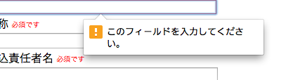

# はじめてのAngularJS

<br>
<br>
<br>

2014/09/27

masakyst

Yomitan.pm

—
## 自己紹介

* さいとう まさあき
* 沖縄 読谷村
* Perl好き
* Yomitan.pm (Perl Mongers Group)
* Twitter @masakyst

—

## アジェンダ

* AngularJSのはじめ方
* こんなアプリを作りました(案件

—

## AngularJSのはじめ方

環境用意

```bash
npm instal bower -g

bower install angularjs --save

vi index.html
```

—

## デモ

—

## こんなアプリを作りました(案件

* 申込者の基本情報
* 参加者情報 複数人可能
* 参加者の中の種目も複数可能
* 同じようにチーム情報も複数可能
* 参加者かチーム、どちらかが必須

—

## 案の定ハマる!!

—

## 必須入力がポップアップしてくる！



(それ、HTML5やで…..)

—

## jqLiteがよくわからない！

内蔵されているDOM操作は、jqLiteになってます。

簡易版jQueryという事で、細かくだいぶ違う点があります。

angularjsだけで既につらいので、せめてjQueryを(ry

<br>

```html
<!— angular.js読み込みより前で —>
<script src="jquery.js" type="text/javascript">
```

—

## 謎のエラーに遭遇!!

### ngRepeat:dupes

Duplicates in a repeater are not allowed. Use ‘track by’ expression to specify unique

<br>

[{id:1,name:'one'}, {id:1,name:'one too'}, {id:2,name:'two'}]

こういう構造の場合、’id’(など)が識別基準になるようです

```javascript
ng-repeat="(index, item) in member.items track by $index"
```

—

## nameにangular式埋め込めない

name="hello_{{$index}}" 

こんな感じで埋め込めればいいんだけど...

hg-repeatしても各要素のvalidationは機能するが、
repeatした要素を参照する方法がない？？

dynamic element validation #1404
https://github.com/angular/angular.js/issues/1404
2年たってる

—

## scopeを他から参照したい

```javascript
// entryFormは、ng-formを設定したオブジェクトとする
var s = angular.element('#entryForm').scope()
s.entryForm.$error //入力エラー
	$dirty //触れた
	$pristine //触れてない
```
—

## hg-repeatした要素は最終番目しか追えない！？

```javascript
//ほら!!
.entryForm.baseForm.membersForm.member_name.$viewValue
```


個々の要素に、$dirty = trueしてもだめなので、FormControllerレベルで提供されている$setDirty() でditryになるようなんだけど、この辺の動き微妙な感じ。
なぜかというと、要素のclassにng-dirtyが付かない。

```javascript
//jquery万歳!!!
 $('form').find('input').addClass('ng-dirty');
```

—

## 値が反映されない！？

普段はデータをいじるだけでビューに反映されるけど、
DOM経由で操作している時に、要素レベルで生えている $setViewValueで値をセットしても、$dirtyにはなるが、
ビューに反映されない。


```javascript
// $renderしよう!!
elm.$setViewValue(‘Perl is undead’);
elm.$render();
```

—

## 1.3-beta $viewValue, $render周り変わってて動かない

$setTouchedはえてる

$setDirtyなぜはえないの…

—


## まとめ

* ハマる
* レールに乗れれば楽園

—

## Yomitan.pm

沖縄でのPerlユーザの集まり！！

<br>

* http://yomitanpm.org/

* https://twitter.com/yomitanpm

* http://lingr.com/room/yomitanpm


